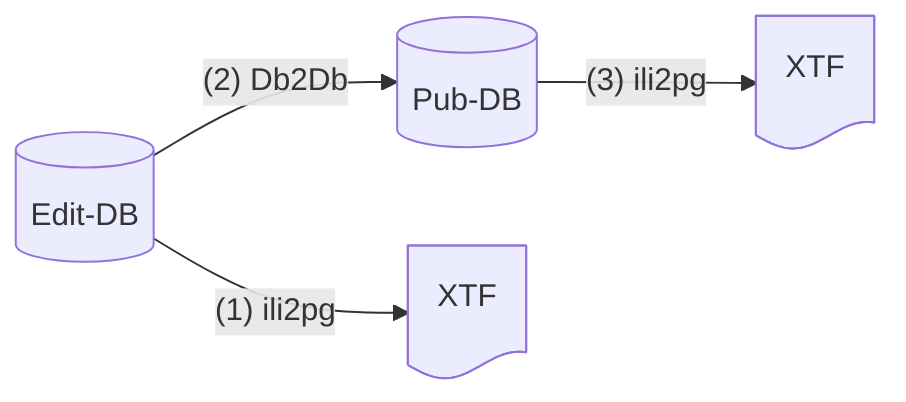
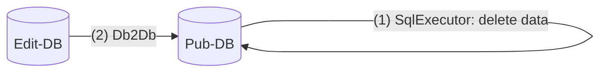
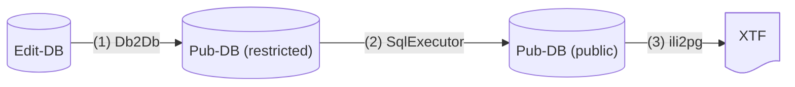

# p-agi_gretl_transaction

- Welche Anwendungsfälle möchten wir mit GRETL-Transaktionen geregelt kriegen?
- Spielt die Reihenfolge der Commits eine Rolle? (Bei Verwendung eines einfachen Transaktionsansatzes != distributed transactions).

## Einfacher Transaktionsansatz

PostgreSQL kennt "distributed transactions", d.h. Transaktionen über Datenbankgrenzen hinweg. Nach erster Lesung scheint dies nicht sonderlich beliebt zu sein (insbesondere im/beim Betrieb). Zudem würde es auch nicht sämtliche Probleme lösen:

- Export in XTF
- Andere Datenbankentypen im Spiel (wahrscheinlich irrelevante Usecases)

Unsere Idee ist folgende: Es gibt jeweils nur eine Connection zu einer DB. Diese wird einmalig geöffnet (z.B. bei der ersten Verwendung) und in in einer Map (o.ä.) vorgehalten. Erst ganz am Schluss wird committed. Es gibt deprecated hooks in Gradle, die nach Ausführung des Jobs ausgeführt werden. Ein anderer Ansatz ist, dass man an jeden Task einen finalizedBy-Task programmatisch hinzufügt, der committed.

## Anwendungsfälle

Anwendungsfälle, bei denen Job-Transaktionen sinnvoll sind.

### UC-1

Stand heute: Export (1) läuft mit eigener Connection. Anschliessend (2) werden zwei Connections geöffnet (Edit- und Pub-DB). [Committed](https://github.com/sogis/gretl/blob/main/gretl/src/main/java/ch/so/agi/gretl/steps/Db2DbStep.java#L116) wird zuerst Edit-DB-Connection (`sourceDbConnection`). Export (3) läuft mit eigener Connection.

Commit-Abfolge heute:

- Edit-DB (1)
- Edit-DB (2)
- Pub-DB (2)
- Pub-DB (3)

Fehlermöglichkeiten:

1. Export in die Edit-XTF funktioniert nicht. Kein Problem, Job wird abgebrochen. Keine Dateninkonsistenz.
2. Transfer von Edit- nach Pub-DB funktioniert nicht. Auf der Dateiablage liegt die exportierte Edit-XTF-Datei, diese entspricht jedoch dem Stand aus der Edit-DB. Diese Konsistenz passt. Man kann aber argumentieren, dass im Web GIS Client etc. was anderes dargestellt wird, als in der publizierten Edit-XTF vorhanden ist. Problem? Eher nein.
3. Export in die Pub-XTF funktioniert nicht. In der Pub-DB (und somit im Web GIS Client, WMS, WFS) sind andere Daten als auf der Dateiablage als XTF/SHP/GPKG/DXF publiziert. In diesem Fall sollte ein Rollback von (2) stattfinden.

Allgemeine Frage: Was passiert, wenn im Db2Db-Task zuerst die Pub-DB (`targetDbConnection`) committed würde?

### UC-2

Stand heute: SqlExecutor (1) öffnet Pub-DB-Connection, löscht Daten (committed) und schliesst die Connection wieder. Db2Db-Task (2) öffnet je eine Edit- und Pub-DB-Connection und kopiert die Daten und schliesst die Connections.

Commit-Abfolge heute:

- Pub-DB (1)
- Edit-DB (2)
- Pub-DB (2)

Fehlermöglichkeiten:

1. Fehler beim Löschen der Daten in Pub-DB. Kein Problem. Job bricht ab. Kein "Loch" in Pub-DB, keine Inkonsistenzen.
2. Fehler beim Kopieren der Daten von Edit-DB nach Pub-DB. Problem: Es gibt ein "Loch" in der Pub-DB. Rollback von (1) muss stattfinden.

### UC-3

Stand heute (wie es wäre, wenn es den zukünftigen Prozess gäbe): Die Daten werden von der Edit-DB in die Pub-DB kopiert (1). Dabei wird eine Edit-DB-Connection und eine Pub-DB-Connection geöffnet und nach dem Kopieren wird committed. Anschliessend werden die geschützten Attribute mit einem SqlExecutor abgestreift (2). Dabei wird eine neue Pub-DB-Connection verwendet. Abschliessend wird die XTF-Datei aus der Pub-DB exportiert (3). Es wird eine neue Pub-DB-Connection verwendet.

Commit-Abfolge heute:

- Edit-DB (1)
- Pub-DB (1)
- Pub-DB (2)
- Pub-DB (3)

Fehlermöglichkeiten:

1. Fehler beim Kopieren der Daten von Edit- nach Pub-DB. Keine Problem. Job bricht ab.
2. Fehler beim Abstreifen der geschützten Attribute in der Pub-DB. Rollback von (1) erwartet, da sonst Pub_restricted != Pub_public. D.h. Inkonsistenzen in Web GIS Client / WMS / WFS. Zudem auch nicht mehr stimmit mit XTF auf Dateiablage.
3. Fehler beim Exportieren der Daten. Rollback (2) und (1) wird erwartet.

